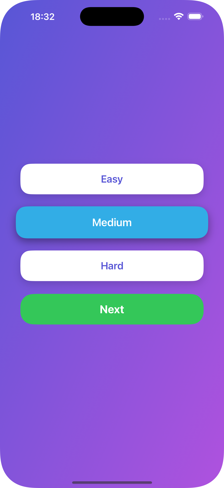
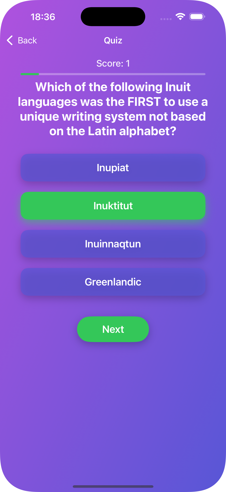
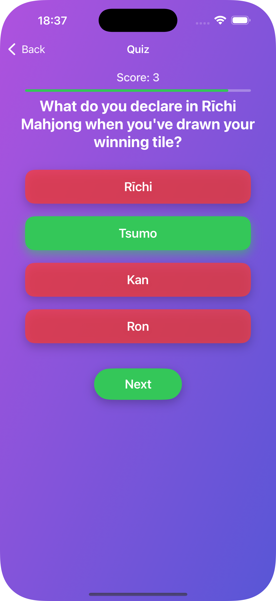

KnowIt, Swift ve UIKit kullanılarak MVVM mimarisiyle ve storyboard kullanılmadan tamamen programatik UI ile geliştirilmiş bir quiz uygulamasıdır. Kullanıcılar zorluk seviyesini seçip quizlere katılabilir.

Özellikler

- Zorluk Seçimi: Easy, Medium, Hard seçenekleri ile quiz zorluk seviyesi belirlenebilir.
- MVVM Mimari: View ve iş mantığı (ViewModel) temiz bir şekilde ayrılmıştır.

